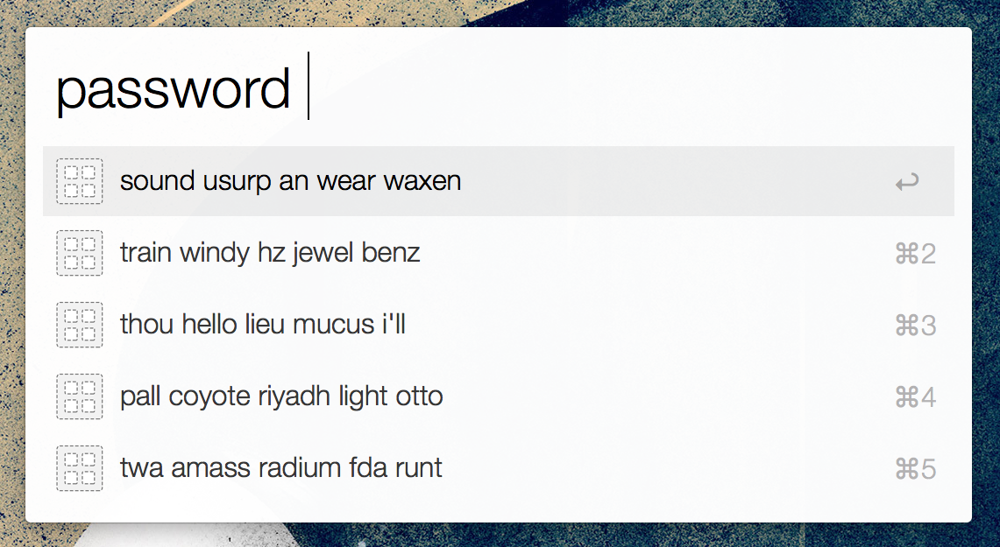
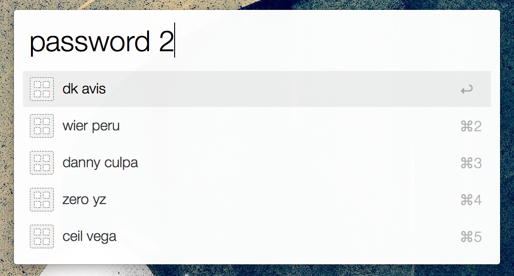

# Alfred-Diceware-Workflow
Alfred workflow for generating passwords using diceware and random.org

Generate passwords using the [Diceware][] wordlist. Random numbers can
be generated using [random.org][] (more secure) or Python's built-in
[random module][python random].

## Use
Open Alfred, type "password" and you'll be presented with a list of 5
password suggestions. Selecting one copies it to your clipboard.



You can customize the number of words in the password by typing a number
as an argument after "password". The default number of words is 5.



## Customizing
You can customize the number of suggestions displayed and the default
number of words in each suggestion by editing the workflow. At the top
of the script are variables `SUGGESTIONS` and `WORDS` which are used to
set the number of suggestions and the number of words per suggestion
respectively.

### Using random.org
To use random.org as your random number generator, you'll need to obtain
an [API key][random.org api] and add it to the script.

Open the preferences window in Alfred, select the "Diceware Password"
workflow, and double-click the "password" Script Filter node. Paste your
API key in this line:

```python
API_KEY = ''
```

Save the changes and the workflow will now use random.org to generate
random numbers.

[Diceware]: http://world.std.com/~reinhold/diceware.html
[random.org]: https://www.random.org
[python random]: https://docs.python.org/2/library/random.html
[random.org api]: https://api.random.org/api-keys/beta
